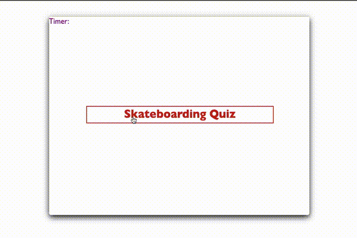

# QuizHomework

## Assignment

this week’s homework was to build a timed coding quiz with multiple-choice questions. the requirements of this app was that it had to run in the browser, and feature dynamically updated HTML and CSS powered by JavaScript code that I wrote. It also was to have a clean, polished, and responsive user interface.

## User Story

```
AS A coding boot camp student
I WANT to take a timed quiz on JavaScript fundamentals that stores high scores
SO THAT I can gauge my progress compared to my peers
```


## Acceptance Criteria

```
GIVEN I am taking a code quiz
WHEN I click the start button
THEN a timer starts and I am presented with a question
WHEN I answer a question
THEN I am presented with another question
WHEN I answer a question incorrectly
THEN time is subtracted from the clock
WHEN all questions are answered or the timer reaches 0
THEN the game is over
WHEN the game is over
THEN I can save my initials and score
```
# Screengrab


# Links

[Deployed Link](https://crozarts.github.io/QuizHomework/)

[GitHub Link](https://github.com/Crozarts/QuizHomework/)   